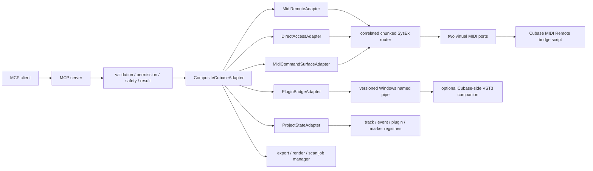

# Architecture

## Boundary

The server controls Cubase only through explicit headless transports. It does
not contain AutoHotkey, SendKeys, Windows UI Automation, OCR, screenshots,
mouse coordinates, keyboard injection, or dialog automation.

## Execution pipeline

Every MCP call follows the same ordered path:

1. Zod input validation, including common options.
2. Permission policy evaluation.
3. capability lookup with no static real-Cubase claims.
4. dry-run planning and affected-object preview.
5. confirmation guard for destructive and overwrite operations.
6. adapter routing and timeout enforcement.
7. state/evidence capture where the host exposes it.
8. structured success or machine-readable error formatting.

## Transport ownership

`MidiRemoteAdapter` owns port connection, handshake, selected-channel host
values, transport values, status polling, and state-event ingestion.

`DirectAccessAdapter` owns feature-detected MIDI Remote API object traversal,
parameter discovery/read/write, subscriptions, and plugin manager requests.

`MidiCommandSurfaceAdapter` owns command registry validation, `canPerform`,
execution, and pre/post state diffs. Command bindings cannot supply arbitrary
dialog parameters.

`PluginBridgeAdapter` first uses supported DirectAccess/Quick Control routes,
then the versioned named-pipe protocol. The TypeScript pipe stub is a protocol
test utility and is never evidence of a real Cubase-side binary.

`ProjectStateAdapter` owns structured cached state, stable server IDs, stale
detection, state diffs, jobs, and filesystem export verification. It does not
mutate `.cpr` files.

`OscAdapter` is opt-in and requires an explicit external Cubase-side OSC
endpoint. `EuConOrMackieAdapter` documents MCU transport capability; EuCon is
proprietary and is not claimed as implemented.

## Long operations

Export, render, scan, hitpoint, silence detection, backup, and large analysis
operations return a job ID. `JobManager` serializes state transitions and
records result/evidence or a machine-readable failure. Export completion is
real only when the Cubase command was observed and expected output files were
verified.
