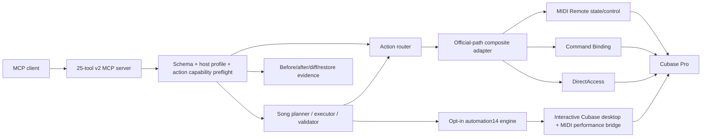

# Architecture

## Boundaries

`src/v2` owns the public action schemas, routing, host profiles, capability claims, evidence audit, resources, and MCP registration.

`src/song` owns musical intent. The planner resolves roles to Cubase track types before the executor is allowed to create anything. The executor creates tracks, instruments/content, and routing, then the validator checks the resulting project. Repair operates only on manifest-owned targets.

`src/automation14` is a separate non-official execution engine for the tested Cubase Pro 14.0.32 desktop. It performs exact-layout preflight, HALion program selection, real-time MIDI recording, MixConsole routing/meter verification, and render analysis. Capabilities always declare `releaseCertified: false`; the official safe14 audit excludes this directory while verifying that no desktop automation leaks into the public runtime.

The existing low-level adapters remain implementation plumbing and legacy migration references. They do not determine public support. `CapabilityRegistry` denies an action before adapter execution unless a certified profile marks it `real`.

## Protocol versions

The MIDI SysEx transport remains framing version 1 (`AIMCP1`/`AIMCP1C`) for compatibility. The application handshake is version 2 and reports `releaseProfile` and `scriptBuild`. Transport version and application contract version are intentionally separate.

## Stable targets

Public actions use `TargetRef`:

- `uniqueId` for a stable project object;
- `objectId` plus `sessionId` for DirectAccess runtime objects;
- `selected` only for explicitly selection-dependent actions.

Song manifests store stable unique track IDs and reject stale or ambiguous bindings.
